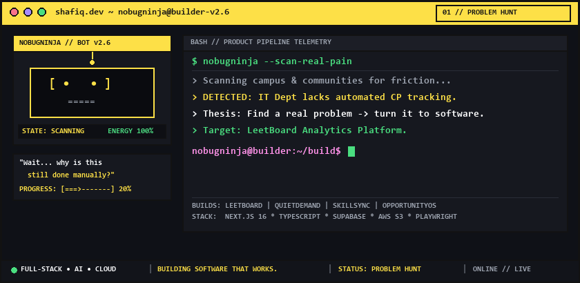
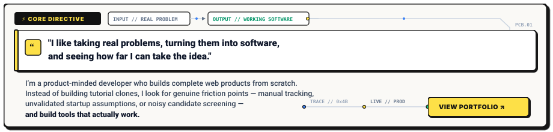
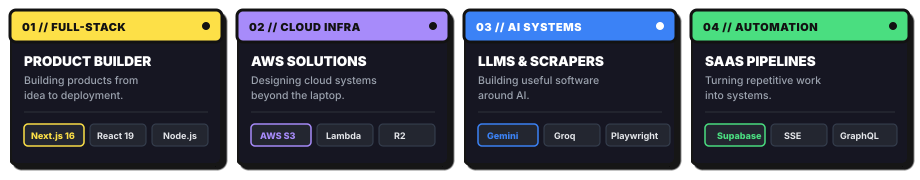
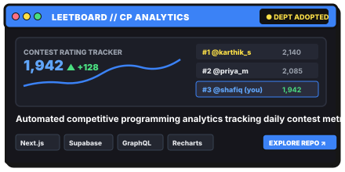
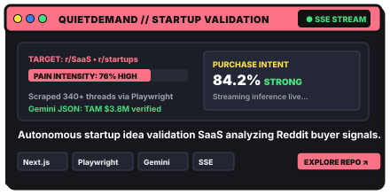
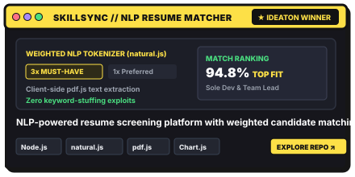
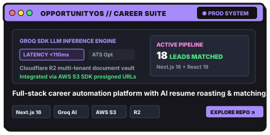
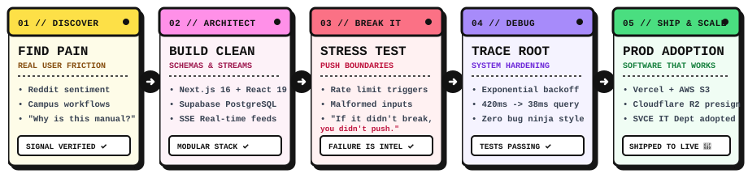
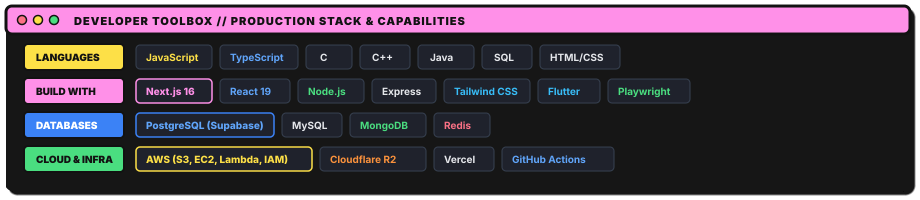

<!-- ======================================================== -->
<!--   MOHAMMED SHAFIQ S — GITHUB PROFILE README             -->
<!--   FULL-STACK • AI • CLOUD  |  SAAS BUILDER             -->
<!-- ======================================================== -->

# MOHAMMED SHAFIQ S
### `FULL-STACK • AI • CLOUD`

**"Find a problem → build something → break it → learn → improve → ship."**

  
  
  
  

<!-- HERO GRAPHIC: NEO-BRUTALIST TERMINAL CREATURE & TELEMETRY -->

  

---

## ⚡ BUILDING SOFTWARE THAT WORKS.

  

---

## 🧭 CURRENTLY BUILDING & EXPLORING

  

---

## 🛠️ FEATURED BUILDS

A visual showcase of products I’ve built from scratch to solve concrete problems *(click any card to view the repository)*:

| | |
| :---: | :---: |
|  |  |
|  |  |

---

## 🔄 HOW I BUILD

> *THINK → DESIGN → BUILD → BREAK → SHIP*

   Design -> Build -> Break -> Ship" width="900" />

---

## 🧰 TECH I WORK WITH

  

---

## 📬 LET'S BUILD SOMETHING.

Whether you're looking for a builder to take a full-stack product from idea to production, exploring cloud-native architectures, or just want to bounce technical ideas around:

  
  
  

  Designed &amp; built with care by <b>Mohammed Shafiq S</b>

