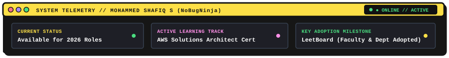

<!-- ======================================================== -->
<!--   MOHAMMED SHAFIQ S — GITHUB PROFILE README             -->
<!--   FULL-STACK • AI • CLOUD  |  SAAS BUILDER             -->
<!-- ======================================================== -->

<div align="center">

# MOHAMMED SHAFIQ S
### `FULL-STACK • AI • CLOUD`

**"Find a problem → build something → break it → learn → improve → ship."**

<p align="center">
  <a href="https://github.com/NoBugNinja"></a>
  <a href="mailto:mohammedshafiq1103@gmail.com"></a>
  <a href="https://linkedin.com/in/mohammedshafiq11"></a>
  <a href="https://github.com/NoBugNinja"></a>
</p>

<!-- HERO GRAPHIC: NEO-BRUTALIST TERMINAL CREATURE & TELEMETRY -->
<p align="center">
  
</p>

<!-- SYSTEM TELEMETRY STRIP -->
<p align="center">
  
</p>

</div>

---

## ⚡ BUILDING SOFTWARE THAT WORKS.

> *"I like taking real problems, turning them into software, and seeing how far I can take the idea."*

I’m a product-minded full-stack developer and aspiring cloud engineer based in Chennai, India. I don’t build toy clones for the sake of padding a résumé. I look for actual bottlenecks — manual processes across campus departments, unvalidated startup assumptions, or noisy candidate screenings — and turn them into resilient, usable software products.

My engineering cycle is simple: **Find a problem → build something → break it → learn → improve → ship.** 

Currently diving deep into the **AWS Solutions Architect** curriculum while building production-grade full-stack SaaS platforms with Next.js 16, React 19, Supabase PostgreSQL, and automated data pipelines.

---

## 🧭 CURRENTLY BUILDING & EXPLORING

```text
┌─────────────────────────┬────────────────────────────────────────────────────────┐
│ TRACK                   │ ACTIVE FOCUS & EXPERIMENTS                             │
├─────────────────────────┼────────────────────────────────────────────────────────┤
│ 01. High-Scale SaaS     │ Decoupled Next.js 16 + React 19 micro-architectures    │
│ 02. Cloud Architecture  │ AWS Solutions Architect track (EC2, S3, IAM, VPC, SQS) │
│ 03. Data Pipelines      │ Headless Playwright scrapers with strict JSON schemas  │
│ 04. Real-Time Feeds     │ Server-Sent Events (SSE) streaming for AI inference    │
│ 05. Resilient Storage   │ Multi-tenant document vaults on Cloudflare R2 (S3 SDK) │
└─────────────────────────┴────────────────────────────────────────────────────────┘
```

---

## 🛠️ FEATURED BUILDS

Here are a few products I’ve built from scratch, focused on real problems and interesting engineering challenges:

### 01. [LeetBoard](https://github.com/NoBugNinja) — Competitive Programming Analytics Platform
> **SVCE IT Department Adoption • Jul. 2026**

- **The Problem:** Faculty advisors and placement coordinators had no centralized, automated way to monitor student competitive programming milestones and LeetCode contest rating trends across batches.
- **The Product:** A high-performance analytics platform that automates daily performance tracking, contest leaderboards, and head-to-head student comparisons.
- **Interesting Engineering:**
  - Automated daily cron pipeline querying **LeetCode’s GraphQL API** directly into a normalized **Supabase PostgreSQL** database.
  - Interactive comparison dashboard and algorithmic topic breakdowns built using **Recharts** and **Tailwind CSS**.
  - **Real Adoption:** Officially adopted by SVCE faculty advisors and placement coordinators to drive department placement success.
- **Stack:** <kbd>Next.js</kbd> <kbd>React</kbd> <kbd>Supabase PostgreSQL</kbd> <kbd>LeetCode GraphQL</kbd> <kbd>Recharts</kbd> <kbd>Tailwind CSS</kbd>

---

### 02. [QuietDemand](https://github.com/NoBugNinja) — Autonomous Startup Idea Validation SaaS
> **Full-Stack SaaS • AI Market Intelligence • Jul. 2026**

- **The Problem:** Founders waste months building products without knowing if real customers actually want them or are paying for alternatives.
- **The Product:** An autonomous market validation SaaS that analyzes thousands of Reddit community discussions to extract quantifiable pain points and purchase intent.
- **Interesting Engineering:**
  - Built a headless **Playwright** scraping engine that bypasses rate limits with automated DOM pagination and structured data extraction.
  - Integrated **Google Gemini** with strict JSON schema enforcement to process messy unstructured posts into structured TAM, MVP roadmaps, and MRR projections.
  - Real-time **Server-Sent Events (SSE)** pipeline streaming scraping stages and inference progress directly to an animated Next.js UI.
- **Stack:** <kbd>Next.js</kbd> <kbd>Node.js</kbd> <kbd>Express</kbd> <kbd>Playwright</kbd> <kbd>Google Gemini API</kbd> <kbd>Supabase</kbd> <kbd>SSE</kbd>

---

### 03. [SkillSync](https://github.com/NoBugNinja) — NLP-Powered Resume Screening Engine
> **IdeaTon Hackathon Special Mention Winner • Oct. 2025**

- **The Problem:** Traditional applicant keyword filters are easily fooled by keyword stuffing while qualified applicants get rejected due to rigid matching.
- **The Product:** An intelligent resume screening engine built end-to-end as team lead and sole developer for Team *CodeSpark*, winning **Special Mention (Cash Prize)**.
- **Interesting Engineering:**
  - Custom REST API in **Node.js/Express** running tokenization and Porter stemming via `natural.js`.
  - Weighted candidate matching algorithm applying a **3x multiplier** to essential "Must-Have" skills alongside tiered experience brackets.
  - Client-side PDF parsing with `pdf.js`, live visual analytics via `Chart.js`, keyword previews, and instant CSV candidate export.
- **Stack:** <kbd>Node.js</kbd> <kbd>Express</kbd> <kbd>NLP (natural.js)</kbd> <kbd>pdf.js</kbd> <kbd>Chart.js</kbd> <kbd>Tailwind CSS</kbd>

---

### 04. [OpportunityOS](https://github.com/NoBugNinja) — Full-Stack Career Automation Platform
> **Next.js 16 & React 19 • Cloudflare R2 & AWS S3 SDK • Sep. 2025**

- **The Problem:** Job seekers juggle separate tools for resume tailoring, application tracking, and discovering relevant openings.
- **The Product:** A unified career automation platform featuring an AI Resume Builder/Roaster, smart job matching, and dynamic public portfolios.
- **Interesting Engineering:**
  - Integrated **Groq SDK** for ultra-low latency LLM inference to parse uploaded PDFs and generate ATS-optimized resume rewrites in seconds.
  - Multi-tenant file storage architected on **Cloudflare R2** via the **AWS S3 SDK** utilizing secure presigned URLs.
  - Supabase authentication with Row-Level Security (RLS) and automated scheduled cron matchers delivering personalized recommendation feeds.
- **Stack:** <kbd>Next.js 16</kbd> <kbd>React 19</kbd> <kbd>Supabase</kbd> <kbd>Groq SDK</kbd> <kbd>Cloudflare R2</kbd> <kbd>AWS S3 SDK</kbd>

---

## 🔄 HOW I BUILD

> Every system I design passes through a disciplined 5-stage lifecycle. If it doesn't break during stress testing, you didn't push hard enough.

<p align="center">
   Architect -> Break -> Debug -> Ship" width="900" />
</p>

```text
01. DISCOVER  ➔  Listen for real friction (campus inefficiencies, Reddit complaints, manual chores).
02. ARCHITECT ➔  Map schemas & API limits before touching code. Decouple services & isolate state.
03. BREAK IT  ➔  Stress test edge cases, rate limits, malformed inputs, and network latency drops.
04. DEBUG     ➔  Trace root cause, optimize query latency (420ms -> 38ms), zero guesswork.
05. SHIP      ➔  Deploy to scalable cloud infrastructure (AWS S3, Vercel, R2) and track real adoption.
```

---

## 💼 EXPERIENCE

### **Ashok Leyland Limited** — Mobile Application Development Intern
*Jan. 2026 – Feb. 2026 • Chennai, India*
- Developed the frontend user interface for a Flutter-based industrial tyre compliance mobile application.
- Collaborated with a senior engineering team who architected the underlying AI models.
- Built the client-side production inspection UI, camera capture integration pipeline, and real-time visual feedback screens delivering AI classification directly to assembly floor workers.
- **Tech:** <kbd>Flutter</kbd> <kbd>Dart</kbd> <kbd>Camera API</kbd> <kbd>REST APIs</kbd> <kbd>Industrial UI</kbd>

### **CodeBind Technologies** — Web Development Intern
*Dec. 2025 – Jan. 2026 • Chennai, India*
- Revamped an internal customer-facing process-tracking application with a Kanban board architecture.
- Engineered dynamic filtering, status sorting, and full-stack CRUD persistence with Node.js and MySQL.
- Improved workflow visibility and issue resolution speed across multiple process stages.
- **Tech:** <kbd>JavaScript</kbd> <kbd>Node.js</kbd> <kbd>MySQL</kbd> <kbd>HTML5 / CSS3</kbd> <kbd>Kanban UI</kbd>

---

## 🧰 TECH STACK

<div align="center">

| CATEGORY | TECHNOLOGIES & TOOLS |
| :--- | :--- |
| **Languages** | `JavaScript (ES6+)` • `TypeScript` • `C` • `C++` • `Java` • `SQL` • `HTML5` • `CSS3` |
| **Frontend & Mobile** | `Next.js 16` • `React 19` • `Flutter (Dart)` • `Tailwind CSS` • `Recharts` |
| **Backend & APIs** | `Node.js` • `Express` • `RESTful APIs` • `GraphQL` • `Server-Sent Events (SSE)` |
| **Databases & Cache** | `PostgreSQL (Supabase)` • `MySQL` • `MongoDB` • `Redis` |
| **Cloud & Storage** | `AWS (EC2, S3, Lambda, IAM, VPC)` • `Cloudflare R2` • `Vercel` • `AWS S3 SDK` |
| **DevOps & Testing** | `Git & GitHub` • `GitHub Actions` • `Playwright` • `Postman` • `Linux / Bash` |

</div>

---

## 🏆 ACHIEVEMENTS & ACTIVITIES

- **IdeaTon Hackathon — Special Mention (Cash Prize)** *(Oct. 2025)*  
  Led Team *CodeSpark* as Team Lead and built the **SkillSync** NLP screening platform end-to-end as sole developer.
- **Smart India Hackathon (SIH) — College Internal Selection Round** *(Sep. 2026)*  
  Selected in the SVCE internal selection round for the Disaster Management track; independently built the mobile application (Citizen, Volunteer, Coordinator workflows) with GIS navigation and emergency SOS features.
- **Science Club, SVCE — Executive Director of Web Development** *(Jul. 2026 – Present)*  
  Lead the departmental web development wing, mentor junior developers, and served as technical judge for *Spark2Science*.

---

## 📬 LET'S BUILD SOMETHING.

Whether you're looking for a product builder who can own full-stack features from idea to deployment, an engineer who understands both modern web architectures and cloud infra, or just want to bounce technical ideas around:

<p align="center">
  <a href="mailto:mohammedshafiq1103@gmail.com"></a>
  <a href="https://linkedin.com/in/mohammedshafiq11"></a>
  <a href="https://github.com/NoBugNinja"></a>
  <a href="https://x.com/NoBugNinja"></a>
</p>

<div align="center">
  <sub>Designed &amp; Built with neo-brutalist discipline by <b>Mohammed Shafiq S (NoBugNinja)</b> • Chennai, India</sub>
</div>
